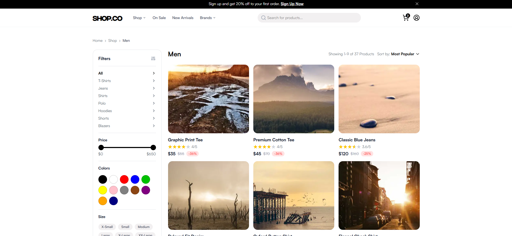
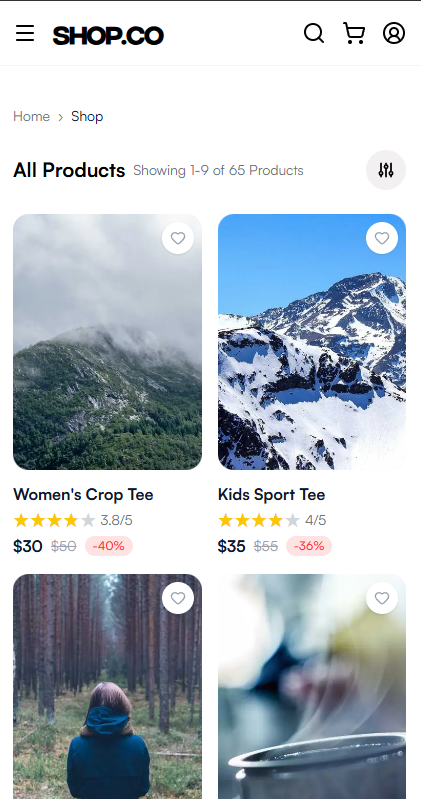
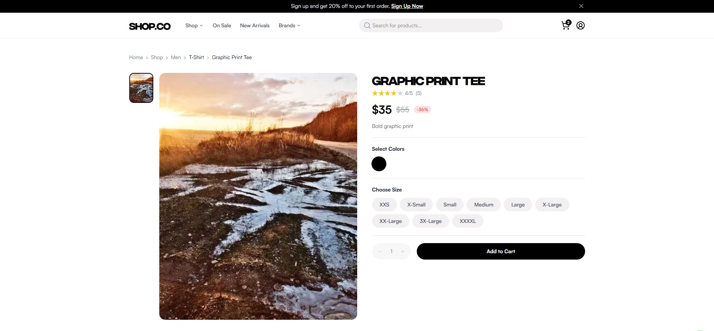
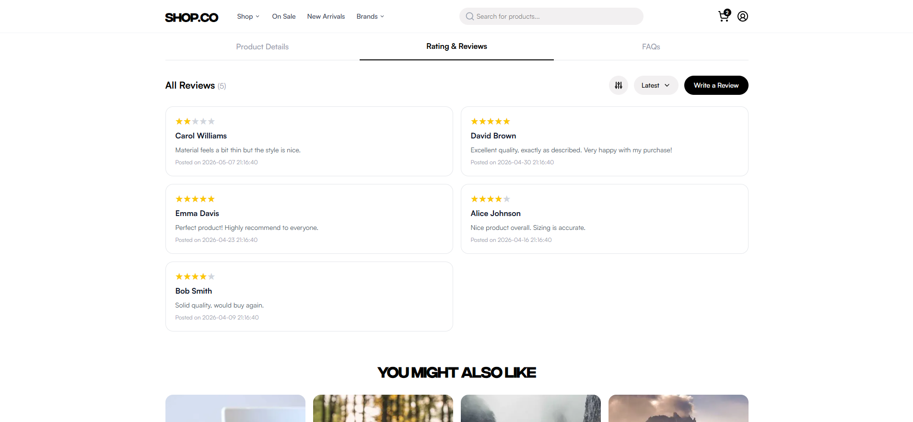
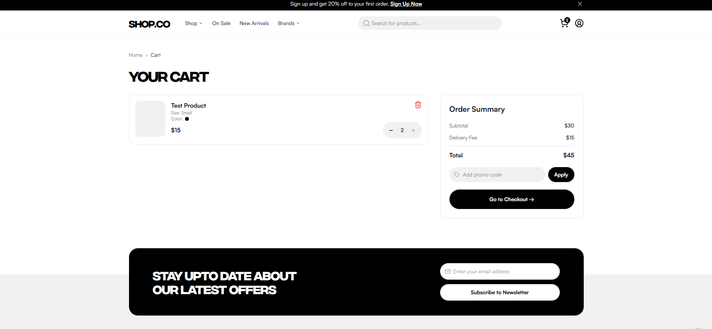
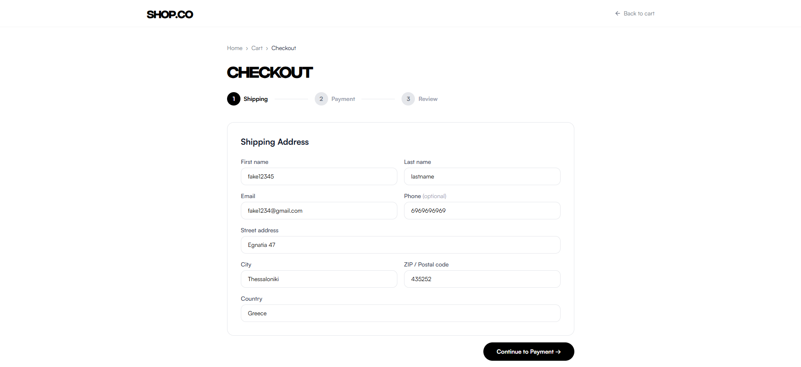
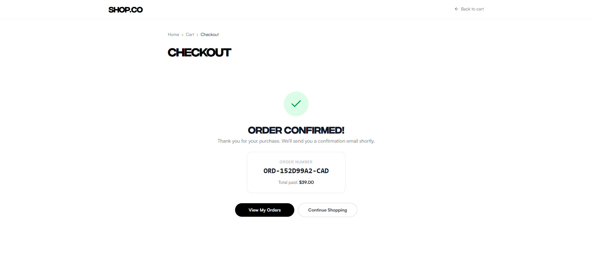
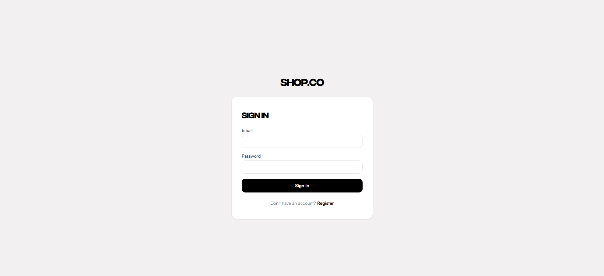
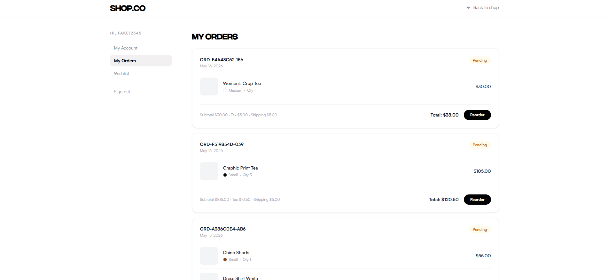
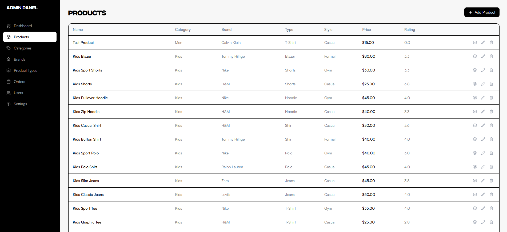

# E-Shop Web Application

A full-stack, enterprise-grade e-commerce platform built with **React.ts** and **Spring Boot (Java 25)**. This project implements a modern shopping experience with a robust admin management system, secure authentication, and a pixel-perfect UI/UX implementation of [this Figma design](https://www.figma.com/design/CUg7MBcDIyMI102Ve2eq3z/E-commerce-Website-Template--Freebie---Community-?node-id=0-1&p=f&t=FVfaRlPS1cf0kvaL-0).

---

## Getting Started

### Option A — Docker (recommended, zero setup)

The only prerequisite is [Docker](https://docs.docker.com/get-docker/). No need
to install Java, Node, or PostgreSQL.

```bash
git clone https://github.com/pagiannis/EcommerceWebsite.git
cd EcommerceWebsite
cp .env.example .env   # fill in your values
docker compose up --build
```

This starts three containers:

| Service | URL |
|---------|-----|
| Frontend (React) | http://localhost:5173 |
| Backend (Spring Boot) | http://localhost:8080 |
| Swagger UI | http://localhost:8080/swagger-ui.html |
| PostgreSQL | internal (port 5432) |

Database credentials live in [`.env`](.env) (local-only defaults). On first run,
`DataInitializer` seeds products, reviews, and a default admin:

```
Email:    admin@test.com
Password: admin12345
```

To stop: `docker compose down` (add `-v` to also wipe the database volume).

---

### Option B — Local development (IntelliJ + Node)

For working on the code directly.

**Prerequisites:** JDK **25** (required by Spring Boot 4.0.5), Node.js 20+,
PostgreSQL 14+.

> **This is a monorepo** — the Maven `pom.xml` is inside `/server`, **not** at the
> repository root. If you open the root in IntelliJ, it will **not** be detected
> as a Spring Boot project.

**Open the backend in IntelliJ:**

1. `File → Open…` → select **`server/pom.xml`** → **"Open as Project"**
2. `File → Project Structure → Project` → set **SDK** to JDK 25 (download via
   `SDKs → + → Download JDK → 25` if needed) and **Language level** to 25.

**Run the backend:**

```bash
# set DB connection (or use Run Configuration → Environment variables in IntelliJ)
export DB_URL=jdbc:postgresql://localhost:5432/eshop
export DB_USERNAME=postgres
export DB_PASSWORD=your_password

cd server
./mvnw spring-boot:run          # macOS / Linux
mvnw.cmd spring-boot:run        # Windows
```

**Run the frontend:**

```bash
cd client
npm install
npm run dev
```

---

### App Screenshots:

#### Home
<table><tr>
  <td></td>
  <td></td>
</tr></table>

#### Shop
<table><tr>
  <td></td>
  <td></td>
</tr></table>

#### Product Detail



#### Cart & Checkout




#### Auth


#### Account


#### Admin


---

## Features

### Customer Experience
- **Smart Catalog:** Filter products by category, price, color, size, and style.
- **Search:** Instant search with autocomplete suggestions.
- **Product Details:** High-quality image carousels, detailed specs, and customer reviews.
- **Cart & Wishlist:** Persisted shopping cart and personal wishlist for logged-in users.
- **Checkout:** Multi-step checkout with address management and multiple payment methods (Card, PayPal, COD).
- **Reviews:** Rate products and leave testimonials for the shop.

### Security & Integrity
- **Rate Limiting:** Protects /login and /register endpoints against brute-force attacks.
- **Session Persistence:** Sessions survive server restarts via JDBC storage.
- **Hardened Cookies:** `HttpOnly` and `SameSite=Strict` protection against XSS and CSRF.
- **Snapshotted Orders:** Orders lock in the price and product name at the time of purchase to maintain historical accuracy.

### Administration
- **Inventory Management:** CRUD for Products, Variants, Brands, and Categories.
- **Order Processing:** Monitor and update order statuses (Processing, Shipped, Delivered, etc.).
- **User Management:** View and manage registered users.
- **Dynamic Settings:** Update Tax rates and Shipping fees directly from the UI without code changes.

---

## Technical Stack

### Frontend (/client)
- **Framework:** [React](https://react.dev/) (Vite)
- **Language:** TypeScript
- **State Management:** [Zustand](https://zustand-demo.pmnd.rs/)
- **Data Fetching:** [TanStack React Query](https://tanstack.com/query/latest)
- **Styling:** [Tailwind CSS](https://tailwindcss.com/)
- **Forms:** React Hook Form + Zod

### Backend (/server)
- **Framework:** [Spring Boot](https://spring.io/projects/spring-boot)
- **Language:** Java 25
- **Database:** PostgreSQL (Production) / H2 (Development/Testing)
- **Security:** Spring Security (Session JDBC, BCrypt)
- **API Docs:** [SpringDoc OpenAPI (Swagger)](https://springdoc.org/)
- **Performance:** Caffeine Cache, Bucket4j (Rate Limiting)
- **Build Tool:** Maven

---

## Project Structure

```text
EcommerceWebsite/
├── client/                # React TypeScript Frontend
│   ├── src/
│   │   ├── api/           # Axios instances & API hooks
│   │   ├── components/    # Reusable UI components
│   │   ├── hooks/         # Custom React hooks
│   │   ├── pages/         # View components (Home, Shop, Product, etc.)
│   │   ├── store/         # Zustand state management
│   │   └── types/         # TypeScript interfaces
│   └── public/            # Static assets
├── server/                # Spring Boot Backend
│   ├── src/main/java/com/ecommerce/server/
│   │   ├── config/        # Security, CORS, and Data initialization
│   │   ├── controller/    # REST API endpoints (Public & Admin)
│   │   ├── dto/           # Data Transfer Objects (Requests/Responses)
│   │   ├── models/        # JPA Entities (Product, Order, User, etc.)
│   │   ├── repository/    # Spring Data JPA Repositories
│   │   ├── security/      # Auth filters & Rate limiting
│   │   └── service/       # Business logic layer
│   └── src/resources/     # SQL schemas & application properties
└── docs/                  # Project documentation & API references
```

---


## License

This project is licensed under the [MIT License](LICENSE).
